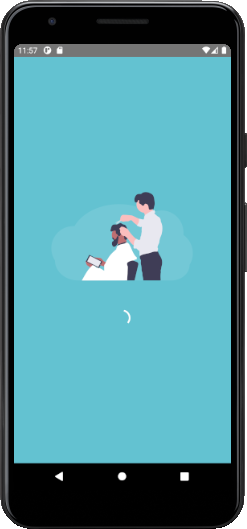

# APP AGENDAMENTO BARBEIRO

App para agendamento para barbeiros. O Barbeiro faz o seu cadastro no App. Quando o usuário logar no App, e quando clicar na localização. O sistema efetuara a busca dos barbeiros cadastrado naquela localidade. App desenvolvido em `REACT NATIVE`.

## 1 - Página Preload

        Quando abre o App é a página que verifica se o usuário tem um TOKEN para acessar. Caso ele não tenha nenhum TOKEN de acesso, ele é redirecionado para a tela de login. 

## 2 – Página SigIn
	
        Na página de login o usuário deve informar o e-mail e também a senha. Se não tiver cadastro, basta clicar no botão informando que não cadastrado, que será redirecionado para a pagina de cadastro.

## 3 – Página SignUp
	
        Nessa página o usuário que quer fazer o cadastro, deve informar o nome completo, e-mail e uma senha.

## 4 – Página Home
	
        Na página Home, o sistema vai listar os Barbeiros cadastrado. E o usuário pode clicar no botão para o sistema buscar a localidade, e listar os Barbeiros cadastrado naquela localidade. Pode informar o nome da cidade e pressionar o ENTER para buscar os barbeiros daquela localidade.

        Ao listar os barbeiros, o sistema vai mostrar a nota, em forma de número e também através de estrelas. Existe o botão ver o perfil do barbeiro. 

---
# 📱 App
## Aplicação Desenvolvida em:
    React Native
---
# 📱 App
## Dependências App: 

    @react-native-community/async-storage: ^1.12.1,
    @react-native-community/geolocation: ^2.0.2,
    @react-native-community/masked-view: ^0.1.10,
    @react-navigation/bottom-tabs: ^5.9.2,
    @react-navigation/native: ^5.7.6,
    react-native-gesture-handler: ^1.8.0,
    react-native-permissions: ^2.2.2,
    react-native-reanimated: ^1.13.1,
    react-native-safe-area-context: ^3.1.8,
    react-native-screens: ^2.11.0,
    react-native-svg: ^12.1.0,
    react-native-svg-transformer: ^0.14.3,
    react-native-swiper: ^1.6.0,
    styled-components: ^5.2.0       
---

---

# 📱 ScreenShot Aplicação

---
<h1 align="center">💻 Desenvolvido Por: Gilberto Júnior</h1>
